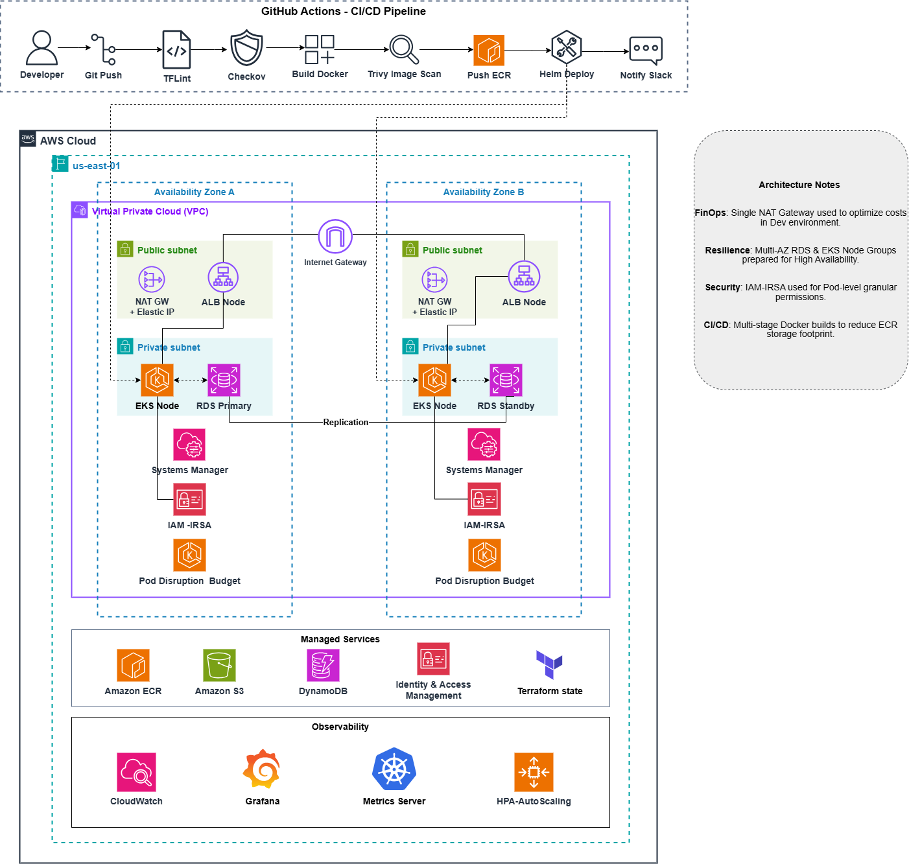

# devops-platform-aws

Plataforma DevOps completa na AWS com ciclo de ponta a ponta —
do commit do desenvolvedor até a aplicação em produção,
monitorada e com infraestrutura provisionada como código.

## Arquitetura

> [📐 Abrir diagrama editável no Draw.io](https://drive.google.com/file/d/1-_1gzO6xLCdZ33gKoaHC3-USYYsIO9n2/view?usp=sharing)

## Stack

| Camada | Tecnologia |
|--------|------------|
| Aplicação | Python Flask + PostgreSQL |
| Container | Docker multi-stage + tag git SHA |
| Registry | Amazon ECR |
| Orquestração | Kubernetes — EKS + Helm Charts |
| IaC | Terraform modular — dev e prod |
| CI/CD | GitHub Actions |
| Segurança IaC | TFLint + Checkov |
| Segurança imagem | Trivy |
| Banco de dados | RDS PostgreSQL Multi-AZ |
| Segredos | AWS SSM Parameter Store |
| Observabilidade | CloudWatch + Grafana + Metrics Server |
| Auto Scaling | HPA — Horizontal Pod Autoscaler |
| Estado Terraform | S3 + DynamoDB lock |
| Resiliência | Pod Disruption Budget |

## Pipeline CI/CD
Developer → Git Push → TFLint → Checkov → Build Docker
→ Trivy Scan → Push ECR → Helm Deploy → Notify Slack

## Estrutura do Projeto
devops-platform-aws/
├── bootstrap/          # Remote state — S3 + DynamoDB
├── terraform/
│   ├── main.tf
│   ├── variables.tf
│   ├── outputs.tf
│   ├── backend.tf
│   └── modules/
│       ├── network/    # VPC, subnets, IGW, NAT Gateway
│       ├── security/   # Security Groups, IAM, IRSA
│       ├── database/   # RDS PostgreSQL Multi-AZ
│       └── compute/    # EKS cluster e node groups
├── envs/
│   ├── dev/            # Variáveis do ambiente dev
│   └── prod/           # Variáveis do ambiente prod
├── helm/app/           # Helm Chart — values dev e prod
├── app/                # API Flask + Dockerfile
├── k8s/                # Pod Disruption Budget
└── .github/workflows/  # Pipeline CI/CD

## Milestones

| Milestone | Entrega |
|-----------|---------|
| M1 — Fundação | Bootstrap S3 + DynamoDB + VPC Multi-AZ + Subnets + IGW + NAT |
| M2 — Banco + App | RDS PostgreSQL Multi-AZ + Dockerfile multi-stage |
| M3 — Orquestração | EKS + Helm Charts + HPA + Pod Disruption Budget |
| M4 — CI/CD | GitHub Actions completo com TFLint + Checkov + Trivy + Slack |
| M5 — Observabilidade | CloudWatch + Grafana + Metrics Server + SLO.md |
| M6 — README | Badges + documentação completa + rollback manual |

## Como provisionar do zero

Documentação adicionada ao longo dos milestones.

## SLO

| Indicador | Meta |
|-----------|------|
| Disponibilidade | 99.5% |
| Latência P95 | < 400ms |

Detalhes em [SLO.md](SLO.md).
